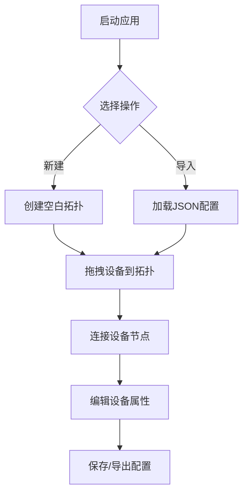

## 1. 产品概述
家庭网络拓扑可视化应用是一个纯前端单页面应用，帮助用户直观地规划和管理家庭网络设备连接关系。通过拖拽式交互，用户可以轻松构建和调整网络拓扑结构，实现网络设备的可视化管理和规划。

目标用户为家庭网络管理员、IT爱好者和需要规划家庭网络的用户，解决网络设备连接关系不清晰、网络规划困难的问题。

## 2. 核心功能

### 2.1 功能模块
应用包含以下核心页面：
1. **主界面**：拓扑图展示区域、设备模板库、属性编辑器
2. **工具栏**：文件操作（新建、导入、导出）、视图控制（缩放、重置）

### 2.2 页面详情
| 页面名称 | 模块名称 | 功能描述 |
|---------|---------|---------|
| 主界面 | 拓扑图区域 | 显示网络设备节点和连接线，支持拖拽移动节点、缩放和平移整个拓扑图 |
| 主界面 | 设备模板库 | 提供预置设备模板（路由器、交换机、终端设备），支持拖拽添加到拓扑图 |
| 主界面 | 属性编辑器 | 显示和编辑选中设备的属性（名称、IP地址、设备类型、备注信息） |
| 工具栏 | 文件操作 | 支持新建拓扑、导入JSON配置文件、导出当前拓扑配置 |
| 工具栏 | 视图控制 | 提供拓扑图缩放、重置视图、自适应显示等功能 |

## 3. 核心流程
用户操作流程：
1. 用户进入应用后，可以选择新建拓扑或导入现有配置
2. 从左侧设备模板库拖拽设备到中央拓扑区域
3. 通过拖拽连接设备节点，系统自动生成连接线
4. 点击节点查看和编辑设备属性信息
5. 完成规划后，导出拓扑配置保存到本地

## 4. 用户界面设计

### 4.1 设计风格
- **主色调**：深蓝色（#1e40af）和灰色（#6b7280）
- **设备颜色**：路由器（蓝色）、交换机（绿色）、终端设备（橙色）
- **按钮样式**：圆角矩形，悬停效果
- **字体**：系统默认字体，标题16px，正文14px
- **布局**：左侧边栏（设备模板）、中央主区域（拓扑图）、右侧边栏（属性编辑）

### 4.2 页面设计
| 页面名称 | 模块名称 | UI元素 |
|---------|---------|--------|
| 主界面 | 拓扑图区域 | 深色背景网格，设备节点采用圆形图标，连接线使用贝塞尔曲线 |
| 主界面 | 设备模板库 | 垂直列表布局，每个模板显示图标和名称，支持拖拽操作 |
| 主界面 | 属性编辑器 | 表单样式，包含输入框和下拉选择器，实时保存修改 |
| 工具栏 | 顶部工具栏 | 水平布局，包含文件操作按钮组和视图控制按钮组 |

### 4.3 响应式设计
- 桌面端优先设计，支持1280px以上屏幕
- 平板端适配，调整侧边栏宽度和布局
- 移动端提供简化视图，重点突出拓扑图区域

### 4.4 交互细节
- 节点拖拽：鼠标悬停时显示拖拽手柄，拖拽过程中显示虚影
- 连接动画：新增连接时显示绘制动画效果
- 选择反馈：选中节点时显示高亮边框和阴影效果
- 缩放控制：鼠标滚轮缩放，双击重置视图