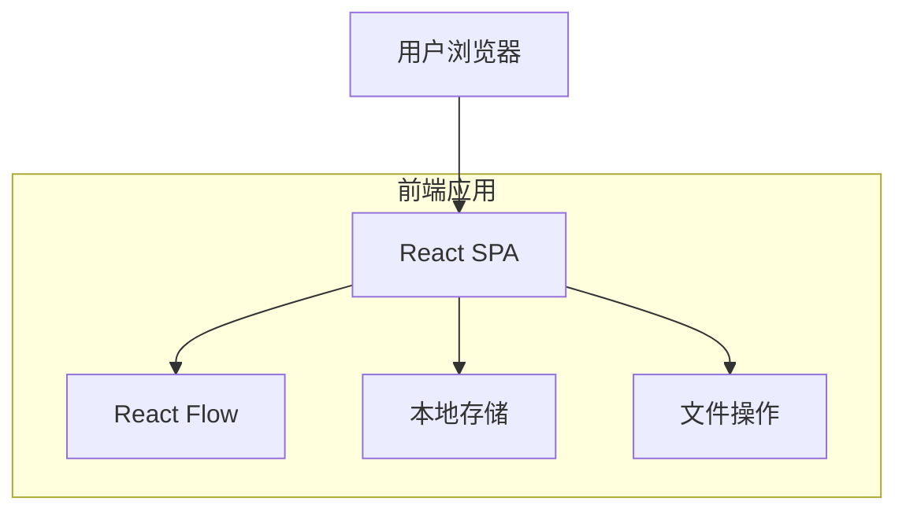
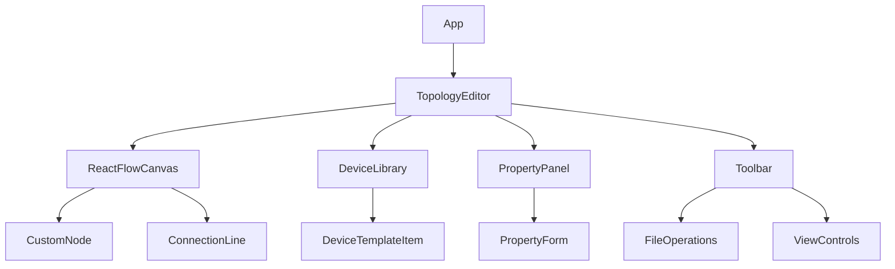

## 1. 架构设计



## 2. 技术描述

- **前端框架**: React@18 + TypeScript
- **初始化工具**: Vite
- **样式框架**: TailwindCSS@3
- **可视化库**: React Flow (reactflow@11)
- **状态管理**: React Context + useState
- **图标库**: Lucide React
- **文件处理**: 原生File API

## 3. 路由定义

| 路由 | 用途 |
|-----|------|
| / | 主界面，包含完整的拓扑编辑功能 |

## 4. 核心类型定义

### 4.1 设备节点类型
```typescript
interface DeviceNode {
  id: string;
  type: 'router' | 'switch' | 'device';
  position: { x: number; y: number };
  data: {
    label: string;
    ipAddress?: string;
    deviceType: string;
    notes?: string;
  };
}

interface DeviceEdge {
  id: string;
  source: string;
  target: string;
  type: 'smoothstep';
}

interface NetworkTopology {
  nodes: DeviceNode[];
  edges: DeviceEdge[];
  metadata: {
    name: string;
    createdAt: string;
    updatedAt: string;
  };
}
```

### 4.2 设备模板类型
```typescript
interface DeviceTemplate {
  id: string;
  name: string;
  type: 'router' | 'switch' | 'device';
  icon: string;
  defaultConfig: {
    ipAddress?: string;
    deviceType: string;
  };
}
```

## 5. 组件架构



## 6. 本地存储结构

### 6.1 存储键值定义
```typescript
// 当前拓扑数据
const STORAGE_KEYS = {
  CURRENT_TOPOLOGY: 'network-topology-current',
  DEVICE_TEMPLATES: 'network-topology-templates',
  SAVED_TOPOLOGIES: 'network-topologies-list'
};
```

### 6.2 存储管理
- **自动保存**: 拓扑变更后3秒自动保存到localStorage
- **版本管理**: 支持创建拓扑快照，便于回滚
- **导入导出**: JSON格式，包含完整的节点和连接信息

## 7. 设备模板库

### 7.1 预置模板
```typescript
const DEFAULT_TEMPLATES: DeviceTemplate[] = [
  {
    id: 'tpl-router',
    name: '路由器',
    type: 'router',
    icon: 'wifi',
    defaultConfig: { deviceType: '无线路由器' }
  },
  {
    id: 'tpl-switch',
    name: '交换机',
    type: 'switch',
    icon: 'server',
    defaultConfig: { deviceType: '千兆交换机' }
  },
  {
    id: 'tpl-pc',
    name: '电脑',
    type: 'device',
    icon: 'monitor',
    defaultConfig: { deviceType: '台式电脑' }
  },
  {
    id: 'tpl-phone',
    name: '手机',
    type: 'device',
    icon: 'smartphone',
    defaultConfig: { deviceType: '智能手机' }
  },
  {
    id: 'tpl-tv',
    name: '智能电视',
    type: 'device',
    icon: 'tv',
    defaultConfig: { deviceType: '智能电视' }
  }
];
```

## 8. 文件格式规范

### 8.1 导出JSON结构
```json
{
  "version": "1.0",
  "metadata": {
    "name": "家庭网络拓扑",
    "createdAt": "2024-01-01T00:00:00.000Z",
    "updatedAt": "2024-01-01T12:00:00.000Z"
  },
  "nodes": [
    {
      "id": "node-1",
      "type": "router",
      "position": { "x": 100, "y": 100 },
      "data": {
        "label": "主路由器",
        "ipAddress": "192.168.1.1",
        "deviceType": "无线路由器",
        "notes": "客厅主路由器"
      }
    }
  ],
  "edges": [
    {
      "id": "edge-1",
      "source": "node-1",
      "target": "node-2",
      "type": "smoothstep"
    }
  ]
}
```

## 9. 性能优化

### 9.1 渲染优化
- 使用React.memo优化节点组件重渲染
- 虚拟化大型拓扑图，只渲染可视区域节点
- 防抖处理拖拽和缩放事件

### 9.2 存储优化
- 使用IndexedDB存储大型拓扑数据
- 实现数据压缩，减少localStorage占用
- 定期清理过期自动保存数据