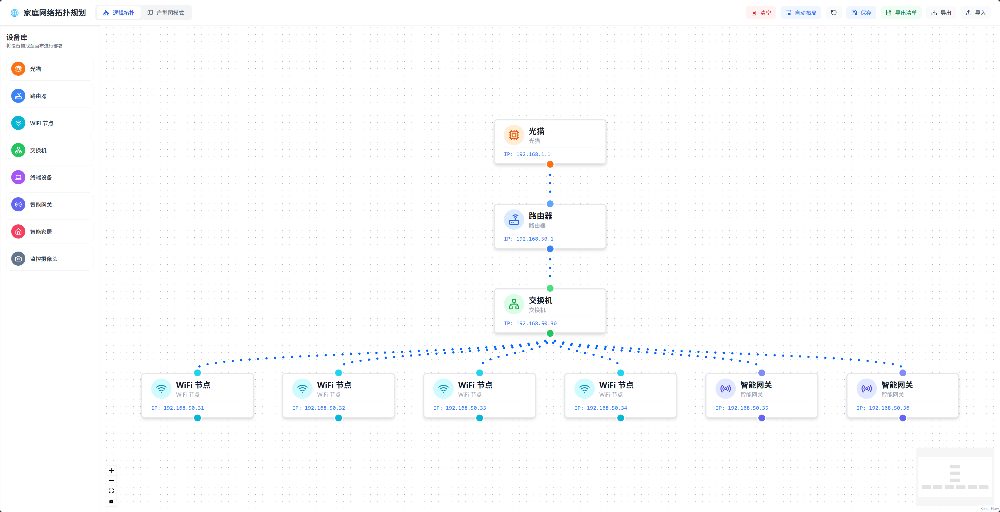

# 家庭网络拓扑规划系统 (Home Network Topology Planner)

中文 | [English](./README_EN.md)

---

这是一个基于 React + Vite + TypeScript 开发的纯前端家庭网络规划与可视化系统。它可以帮助用户直观地设计家庭网络架构，并支持在户型图上进行设备点位布放。



### ✨ 核心特性

- **双模式切换**：
  - **逻辑拓扑模式**：专注于网络架构逻辑，支持自动布局、IP 自动分配与子网继承。
  - **户型图模式**：支持上传户型底图，将设备图标拖拽到实际房间位置，实现物理点位规划。
- **智能 IP 管理**：支持 192.168.x.x 网段选择，自动继承上级设备的网段。
- **可视化交互**：炫酷的蓝色粒子流连线动画，代表网络数据传输。
- **数据管理**：自动保存到浏览器本地存储，支持导出/导入 JSON 与一键导出 Excel 设备清单。

### 🚀 快速开始

1. **安装依赖**：`pnpm install`
2. **启动开发**：`pnpm dev`
3. **构建发布**：`pnpm build`

### 🐳 Docker 快速运行

如果你想快速体验，可以直接运行现成的 Docker 镜像：

```bash
docker run -d -p 8080:80 harlin/home-network-planner:latest
```

启动后访问 `http://localhost:8080` 即可。

#### 使用 docker-compose (本地构建/部署)

```bash
docker-compose up -d
```

### 🛠️ 技术栈

React 18, React Flow, Dagre, Tailwind CSS, Lucide React, SheetJS.

---

## 📄 开源协议

MIT License
